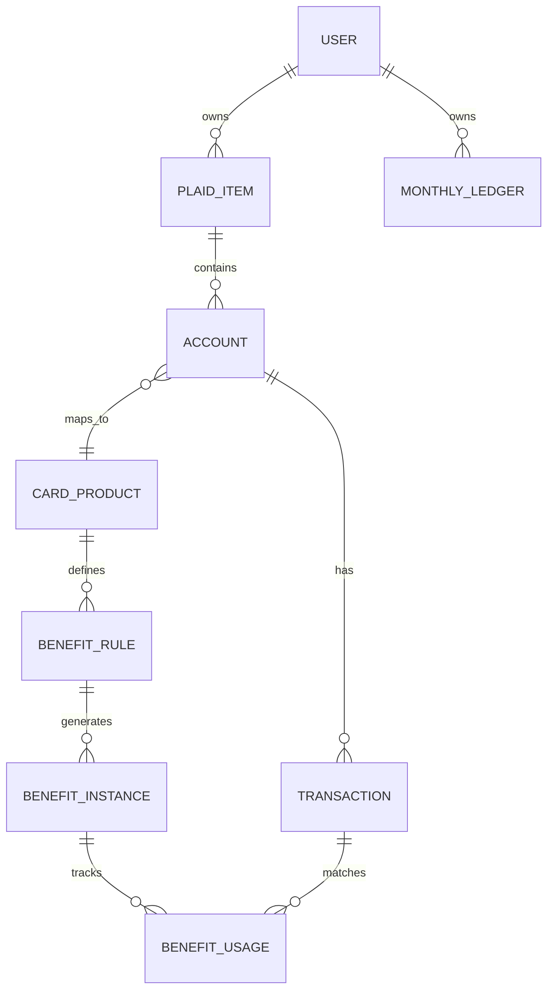

# Data Model

## Entity Overview



## Core Tables

### users

- `id`
- `email`
- `password_hash` or external auth provider id
- `created_at`
- `deleted_at`
- `default_currency`
- `locale`
- `timezone`

### plaid_items

- `id`
- `user_id`
- `plaid_item_id`
- `institution_id`
- `institution_name`
- `encrypted_access_token`
- `transactions_cursor`
- `status`
- `last_successful_sync_at`
- `last_error_code`
- `created_at`
- `updated_at`
- `removed_at`

### accounts

- `id`
- `user_id`
- `plaid_item_id`
- `plaid_account_id`
- `name`
- `official_name`
- `mask`
- `type`
- `subtype`
- `current_balance`
- `available_balance`
- `credit_limit`
- `iso_currency_code`
- `card_product_id`
- `user_display_name`
- `is_hidden`
- `created_at`
- `updated_at`

### credit_liabilities

- `id`
- `account_id`
- `last_statement_issue_date`
- `last_statement_balance`
- `minimum_payment_amount`
- `next_payment_due_date`
- `last_payment_amount`
- `last_payment_date`
- `is_overdue`
- `aprs_json`
- `synced_at`

### transactions

- `id`
- `user_id`
- `account_id`
- `plaid_transaction_id`
- `date`
- `authorized_date`
- `merchant_name`
- `name`
- `original_description`
- `amount`
- `iso_currency_code`
- `pending`
- `personal_finance_category_primary`
- `personal_finance_category_detailed`
- `user_category_id`
- `payment_channel`
- `location_json`
- `account_owner`
- `removed_at`
- `created_at`
- `updated_at`

### card_products

- `id`
- `issuer`
- `network`
- `name`
- `slug`
- `annual_fee`
- `country`
- `is_active`
- `terms_url`
- `created_at`
- `updated_at`

### benefit_rules

- `id`
- `card_product_id`
- `name`
- `description`
- `period_type`
- `period_limit_amount`
- `currency`
- `reset_rule`
- `requires_enrollment`
- `merchant_matchers_json`
- `category_matchers_json`
- `credit_matchers_json`
- `confidence_default`
- `terms_url`
- `is_active`
- `created_at`
- `updated_at`

### benefit_instances

- `id`
- `benefit_rule_id`
- `user_id`
- `account_id`
- `period_start`
- `period_end`
- `limit_amount`
- `used_amount`
- `status`
- `computed_at`

### benefit_usages

- `id`
- `benefit_instance_id`
- `transaction_id`
- `amount`
- `status`
- `confidence`
- `match_source`
- `explanation`
- `manual_note`
- `created_at`
- `updated_at`

### monthly_ledgers

- `id`
- `user_id`
- `period_start`
- `period_end`
- `period_type`
- `total_spend`
- `category_summary_json`
- `card_summary_json`
- `merchant_summary_json`
- `computed_at`

## Benefit Rule Example

```json
{
  "name": "Monthly dining credit",
  "period_type": "monthly",
  "period_limit_amount": 10,
  "currency": "USD",
  "reset_rule": {
    "type": "calendar_month",
    "timezone": "America/New_York"
  },
  "requires_enrollment": false,
  "merchant_matchers": [
    {
      "type": "merchant_name_contains",
      "values": ["Grubhub", "The Cheesecake Factory"]
    }
  ],
  "category_matchers": [
    {
      "type": "plaid_personal_finance_category",
      "primary": "FOOD_AND_DRINK"
    }
  ],
  "credit_matchers": [
    {
      "type": "statement_credit_description_contains",
      "values": ["DINING CREDIT"]
    }
  ]
}
```

## Benefit Status Values

- `unused`
- `partially_used`
- `used`
- `pending_credit`
- `requires_enrollment`
- `ignored`
- `expired`
- `unknown`

## Manual Overrides

Manual overrides should never mutate the original Plaid transaction. They should create or update app-owned classification records so the raw source data remains auditable.

Manual override types:

- Set user category.
- Mark transaction as benefit usage.
- Remove transaction from benefit usage.
- Mark benefit instance as used.
- Mark benefit instance as ignored.

