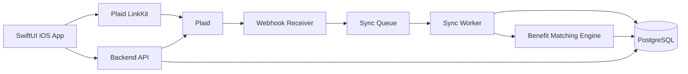

# Technical Architecture

## Recommended Stack

iOS:

- SwiftUI.
- async/await.
- Combine only where it simplifies reactive state.
- Plaid LinkKit through Swift Package Manager.
- Keychain for small local secrets.
- Local encrypted cache for recent summaries.

Backend:

- TypeScript with Node.js, or Python with FastAPI.
- PostgreSQL.
- Background jobs for sync and matching.
- KMS-backed encryption for Plaid access tokens.
- Object storage for exported reports if needed.

Infrastructure:

- API service.
- Worker service.
- Plaid webhook receiver.
- Managed Postgres.
- Secret manager.
- Observability with structured logs and alerts.

## High-Level Flow

## Plaid Link Flow

1. iOS calls backend: `POST /plaid/link-token`.
2. Backend creates a Plaid `link_token`.
3. iOS opens Plaid LinkKit with the token.
4. User selects institution and accounts.
5. iOS receives `public_token` in Link success callback.
6. iOS sends `public_token` to backend: `POST /plaid/exchange-public-token`.
7. Backend exchanges it for `access_token`.
8. Backend encrypts and stores `access_token`.
9. Backend starts initial transaction sync.
10. User sees pending sync state.

For iOS OAuth flows, use Universal Links for the Plaid redirect URI.

## Plaid Products

Use:

- Transactions: monthly ledger, categories, merchants, benefit matching.
- Liabilities: due dates, minimum payment, statement balance, APR, credit limit where available.
- Accounts: account names, type, subtype, mask, balances.

Initial Plaid product setup should include `transactions` and `liabilities` when supported. Use account filters to prioritize credit card accounts, but allow depository accounts if the product later needs cash flow context.

## Transaction Sync

Use `/transactions/sync` with a stored cursor per Plaid item.

Sync states:

- `initializing`
- `historical_pending`
- `healthy`
- `login_required`
- `sync_error`
- `disconnected`

Webhook handling:

- Listen for `SYNC_UPDATES_AVAILABLE`.
- Enqueue a sync job for the item.
- Fetch added, modified, and removed transactions.
- Upsert added and modified transactions.
- Soft-delete removed transactions.
- Recompute affected monthly ledgers.
- Re-run benefit matching for affected periods.

## Liabilities Sync

Use `/liabilities/get` on a daily schedule and after relevant webhooks.

Store:

- Last statement issue date.
- Last statement balance.
- Minimum payment amount.
- Next payment due date.
- Last payment amount and date.
- APR details.

Do not treat liability data as the source for transaction history.

## Benefit Matching Engine

Inputs:

- Normalized transactions.
- User-confirmed card product.
- Benefit rules.
- Benefit period instances.
- Manual overrides.

Matching order:

1. Manual override.
2. Explicit merchant rule.
3. Merchant alias rule.
4. Plaid personal finance category rule.
5. Statement credit reverse match.
6. Amount and timing heuristic.

Each match should store:

- Benefit rule id.
- Transaction id.
- Matched amount.
- Confidence.
- Explanation.
- Match source.

## API Surface

Authentication:

- `POST /auth/sign-up`
- `POST /auth/sign-in`
- `POST /auth/refresh`
- `POST /auth/logout`

Plaid:

- `POST /plaid/link-token`
- `POST /plaid/exchange-public-token`
- `POST /plaid/update-link-token`
- `POST /plaid/webhook`
- `DELETE /plaid/items/{itemId}`

Ledger:

- `GET /ledger/months/{yyyy-mm}`
- `GET /ledger/months/{yyyy-mm}/transactions`
- `PATCH /transactions/{transactionId}`

Cards:

- `GET /cards`
- `GET /cards/{cardId}`
- `PATCH /cards/{cardId}`
- `POST /cards/{cardId}/confirm-product`

Benefits:

- `GET /benefits/periods/current`
- `GET /benefits/cards/{cardId}`
- `PATCH /benefit-usages/{usageId}`
- `POST /benefits/{benefitId}/manual-usage`

Settings:

- `GET /exports`
- `POST /exports`
- `DELETE /account`

## iOS App Architecture

Suggested layers:

- `App`: app entry, dependency container, routing.
- `Features`: Home, Ledger, Benefits, Cards, Settings, Onboarding.
- `DesignSystem`: colors, typography, reusable controls.
- `Networking`: API client, auth interceptor, DTOs.
- `Plaid`: LinkKit wrapper.
- `Models`: domain models.
- `Persistence`: local cache.

Use view models for screen state and service protocols for API access. Keep Plaid SDK usage isolated behind a small adapter so it is easy to test the onboarding flow.

## Observability

Track server-side events:

- Plaid link token created.
- Plaid item connected.
- Initial sync started and completed.
- Transaction sync failed.
- Item login required.
- Benefit match created.
- Manual override created.

Do not log raw transaction descriptions, full access tokens, account numbers, or sensitive user notes.

